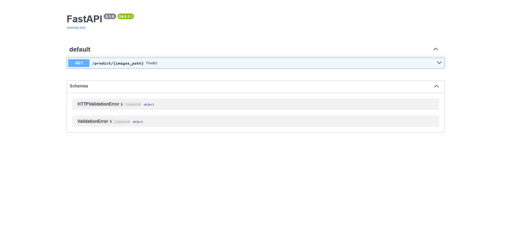
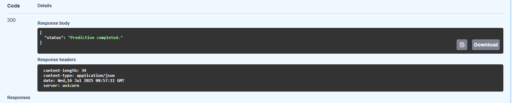

# Description

This project can be used for classification of bones CT scans for 2 classes: fractured and non-fractured bones.

# Installation and usage

1. One your terminal and paste there command: 

```git clone https://github.com/Supcanc/BonesClassification```.


2. Load images that you want to predict in images_to_predict/ directory.


3. Enable your Docker.


4. Type in the terminal(in the project diretctory) this command: 

```docker-compose build```.


5. Then type another command in this directory:

```docker-compose up```.


6. You'll see a link in a terminal, click on it and then add /docs to the end of this link and you'll be taken to this page:

7. Click on button 'GET'.


8. Click on button 'Try it out'.


9. Type images_to_predict in description input window.


10. Click button 'Execute'.


11. Check if the response is same:

12. There will be file predictions.txt in your project directory with all your predictions.

# Dataset Information

This project uses the [X-Ray Imaging Dataset for Detecting Fractured vs. Non-Fractured Bones](https://www.kaggle.com/datasets/foyez767/x-ray-images-of-fractured-and-healthy-bones), originally created by Nayem et al. (2025) and sourced from Mendeley Data. The dataset was obtained via Kaggle.

# Citation

@dataset{nayem2025xray,

  author       = {Nayem, Farhan Masud and Arif, Arifur Rahman and Rafe, Maruful Islam and Prity, Farida Siddiqi},

  title        = {X-Ray Imaging Dataset for Detecting Fractured vs. Non-Fractured Bones},

  year         = 2025,

  publisher    = {Mendeley Data},

  version      = {V1},

  doi          = {10.17632/cd6jjsxz44.1},

  url          = {https://doi.org/10.17632/cd6jjsxz44.1}

}
